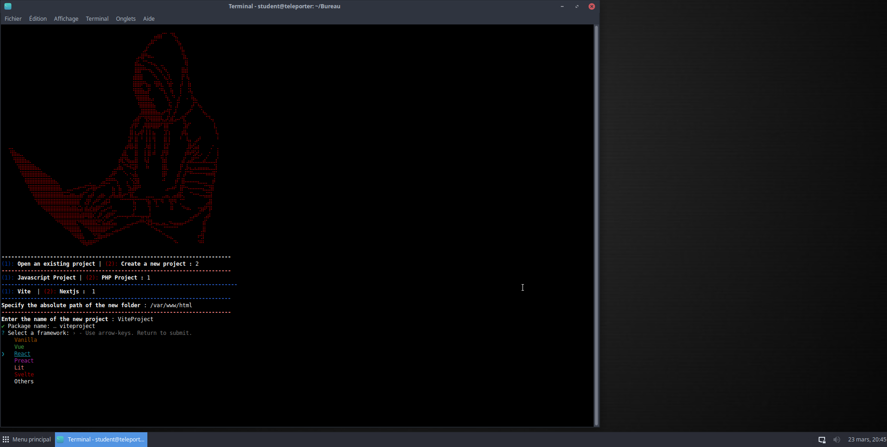

# ProjectManager



## Description:
Allows the opening of a project present in the file /var/www/html :
- opening VirtualStudioCode
- opening of the php Server 
- opening of the browser google-chrome

Allows the creation of a project :
- Javascript : Vite or Nextjs 
- Php : Symfony or Wordpress


## Update :
An update will take place to allow the possibility to choose the browser and the server you want to open

## requirements:
- nodejs
- npm 
- php
- composer 

## Architecture
```
├── DEBIAN
│   └── control
└── usr
    ├── bin
    │   └── project_manager.sh
    └── share
        ├── applications
        │   └── project_manager.desktop
        └── icons
            └── icon.png
```
## Install
- Download the .deb package
```bash
sudo dpkg -i projectManager.deb
```
- Use the following command to install the package : 

```bash
project_manager.sh
```

## Uninstall
```bash
sudo apt-get remove project-manager 
```